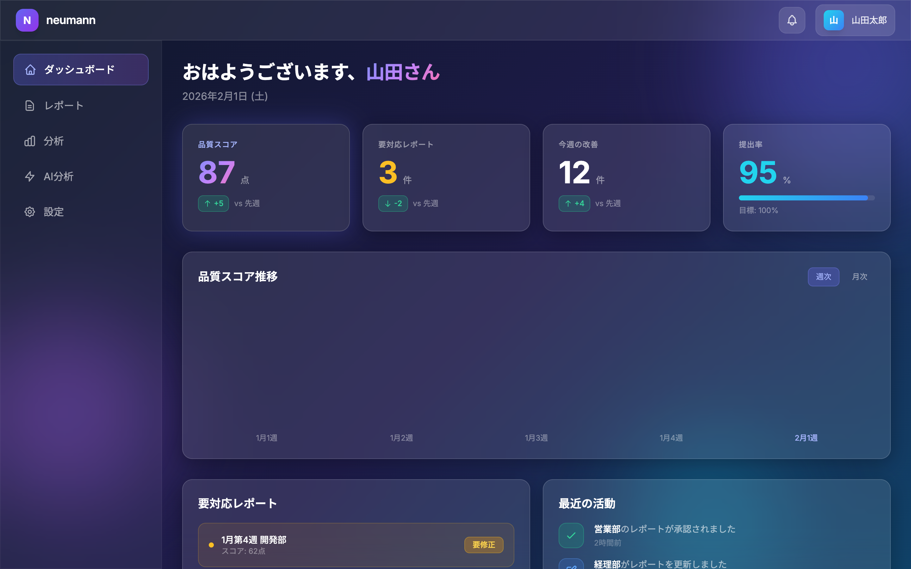

# neumann Design System

AI駆動の週次レポート品質管理ツールのデザインシステム。

## Design Direction

**AI-Native Glassmorphism（AI時代のグラスモーフィズム）**

| キーワード | 要素 |
|-----------|------|
| **先進・AI・未来** | ダークグラデーション背景、光るエフェクト |
| **グラスモーフィズム** | 半透明カード、ぼかし効果、微細なボーダー |
| **鮮やかなアクセント** | パープル・ブルー・シアンのグラデーション |

## Design Philosophy

> 「AIの力を可視化し、データを美しく伝える」

先進的なAIツールにふさわしい、未来感のあるUIを提供。グラスモーフィズムにより、情報の階層を視覚的に表現しながら、洗練された印象を与える。

## Preview



*ダッシュボード画面のデザインイメージ*

## Contents

| ドキュメント | 内容 |
|-------------|------|
| [principles.md](./principles.md) | 設計原則（5つの原則） |
| [colors.md](./colors.md) | カラーシステム・デザイントークン |
| [typography.md](./typography.md) | タイポグラフィ |
| [spacing.md](./spacing.md) | スペーシング・レイアウト |
| [icons.md](./icons.md) | アイコン |
| [components.md](./components.md) | コンポーネント |
| [patterns.md](./patterns.md) | UIパターン |
| [motion.md](./motion.md) | モーション・アニメーション |
| [accessibility.md](./accessibility.md) | アクセシビリティ |

## Tech Stack

| カテゴリ | 技術 |
|----------|------|
| CSS Framework | Tailwind CSS |
| Component Library | shadcn/ui (カスタマイズ) |
| Icons | Lucide Icons |
| Charts | Recharts |

## Quick Reference

### Brand Colors

```
Background: Dark Gradient  #0f172a → #1e1b4b → #0c4a6e
Glass:      White 8%       rgba(255,255,255,0.08)
Primary:    Indigo         #6366f1
Accent:     Purple         #a855f7
Cyan:       Cyan           #06b6d4
Success:    Emerald        #10b981
Warning:    Amber          #f59e0b
Error:      Rose           #f43f5e
Text:       White          #ffffff (opacity variants)
```

### Typography Scale

```
Display:  48px / 600 / -0.02em
H1:       36px / 600 / -0.02em
H2:       24px / 600 / -0.01em
H3:       20px / 500 / 0
Body:     16px / 400 / 0
Small:    14px / 400 / 0
Caption:  12px / 400 / 0.01em
```

### Spacing Scale

```
4px  (xs)   →  密接した要素間
8px  (sm)   →  関連要素間
16px (md)   →  セクション内要素間
24px (lg)   →  セクション間
32px (xl)   →  大きなセクション間
48px (2xl)  →  ページセクション間
```

---

**ステータス**: 🟡 Draft
**オーナー**: 協働
**最終更新**: 2026-02-01

