# v1.0 Manager Response Flow

マネージャー（レポート作成者）が曖昧性指摘に対応するフローを定義する。

## 重要な位置づけ

```
📌 マネージャーは neumann の「能動的ユーザー」ではない。
   彼らは AI による「監査・支援対象」である。（personas.md より）
```

v1.0 では、マネージャーの対応フローは **最小限** に留め、
CEO体験の価値検証を優先する。

## ユーザーフロー概要

### Flow 1: AIによる自律的な曖昧性検出と改善案提示（v1.1）

**v1.1 の自律フロー**:
1. マネージャーがレポートを記述
2. AIが曖昧性を検出
3. AIが自律的にデータを取得（Supabase, Google Sheets等）
4. AIが改善案を提示
5. マネージャーが改善案を確認・適用

**詳細フロー**:

```mermaid
sequenceDiagram
    participant Manager
    participant Report
    participant AI as neumann AI
    participant DataSource as データソース

    Manager->>Report: 「全体的に厳しい状況です」と入力
    Report->>AI: 曖昧性検出
    AI->>AI: 定量性不足を検出

    AI->>DataSource: 関連データを自律取得
    Note over DataSource: Supabase KPI実績値<br/>Google Sheets 売上管理

    DataSource->>AI: 商談化率: 25% → 10% (-15pt)
    AI->>Manager: FactCard 表示

    Note over Manager: 💡 改善案を確認<br/>「前月比で商談化率が<br/>25%→10%に低下（-15pt）」

    Manager->>Report: ワンクリック適用 (v1.2) or 手動コピー (v1.1)
    Report->>AI: 再監査
    AI->>Manager: 曖昧性解消を確認
```



**ステップ詳細**:

1. **レポート作成中** → マネージャーが定性的な表現を入力
2. **AIが自律検出** → 曖昧性を検出（定量性不足、深掘り不足等）
3. **AIがデータ取得** → 関連する情報を外部ツールから自律的に取得
   - Supabase: KPI実績値
   - Google Sheets: 前月比データ
   - Salesforce: 商談データ（v1.2）
4. **FactCard表示** → 取得したデータと改善案を提示
5. **マネージャーが確認** → 改善案を適用または手動編集
6. **再監査** → AIが曖昧性解消を自動確認

**v1.0 では手動運用**:
- CEOまたは運用担当が、マネージャーにSlack/メールで直接連絡
- マネージャーはGoogle Slides/Notionで資料を修正
- neumannに再インポート（手動）

### Flow 2: 曖昧性指摘への対応（v1.1 自動化）

```mermaid
sequenceDiagram
    participant AI as neumann AI
    participant Manager
    participant Report
    participant CEO

    AI->>Manager: 曖昧性指摘の通知（Slack/メール）
    Manager->>Report: 資料を修正
    Report->>AI: 変更検知
    AI->>Report: 再監査

    alt 曖昧性解消
        AI->>Manager: "解決しました" 通知
        AI->>CEO: ステータス更新（Anomaly消去）
    else まだ曖昧
        AI->>Manager: "追加修正が必要です" + 具体的指摘
    end
```



### Flow 3: レポート提出前のセルフチェック（v1.1）

```mermaid
sequenceDiagram
    participant Manager
    participant Report
    participant AI as neumann AI

    Manager->>Report: 資料作成
    Manager->>AI: "レビューして"
    AI->>Report: 曖昧性チェック実行
    AI->>Manager: 指摘一覧を表示

    loop 指摘がなくなるまで
        Manager->>Report: 修正
        Manager->>AI: "再チェック"
        AI->>Manager: 更新された指摘
    end

    AI->>Manager: "曖昧性ゼロ達成" 🎉
    Manager->>Report: 提出
```



## v1.0 での運用

### 手動フロー

1. CEO が neumann でAnomalyを確認
2. CEO が該当マネージャーにSlackで連絡
   - 「Enterprise Sales の週次報告について、以下の点を修正してください」
   - 指摘内容をコピー&ペースト
3. マネージャーが資料を修正
4. 運用担当が更新された資料をneumannに再インポート
5. CEO が neumann で修正を確認

### v1.0 では自動化しない理由

| 理由 | 説明 |
|------|------|
| CEO体験優先 | まずCEOにとっての価値を検証する |
| 技術検証先行 | Slack/Notion/Slides連携は技術リスクが高い |
| 行動変容の観察 | マネージャーがAI指摘にどう反応するか観察 |
| 運用知見蓄積 | 自動化前に運用フローを確立 |

## v1.1 で実装予定の機能

| 機能 | 説明 |
|------|------|
| **自律的情報収集** | AIがSupabase/Google Sheetsから関連データを自動取得 |
| **FactCard表示** | 取得したデータと改善案をカード形式で提示 |
| **ルールベース推論** | 曖昧性パターンから必要な情報源を自動判定 |
| 自動通知 | 曖昧性検知時にSlack/メールで自動通知 |
| タスク管理 | 未対応の指摘をタスクとして管理 |
| エスカレーション | 期限内に対応がない場合、CEOに通知 |
| 対応履歴 | 誰がいつ修正したかの履歴管理 |

## マネージャー体験の設計方針

```
❌ 避けるべき: マネージャーが「監視されている」と感じる
✅ 目指すべき: マネージャーが「支援されている」と感じる
```

### 具体的なトーン設計

**NG例**:
```
⚠️ 警告: あなたのレポートに曖昧な表現があります。直ちに修正してください。
```

**OK例（v1.1 自律情報収集版）**:
```
📝 レポート改善の提案があります。

💡 関連する情報を取得しました:
• 商談化率: 25% → 10% (-15pt) [データソース: KPI実績値]
• 受注確率: A社 80%, B社 60% [データソース: Salesforce]

改善案:
「前月比で商談化率が25%→10%に低下（-15pt）。
 A社は受注確率80%で順調だが、B社は60%で要注意」

[この案を使う] [自分で編集]
```

### 長期的なゴール（personas.mdより）

> AIからの「冷徹な指摘（Fact-Checking）」を受ける主たる対象。
> 当初はAIを「監視役」として警戒するが、AIとの対話を通じて
> 「論理的な課題解決（分解・構造化）」を学習し、
> 経営幹部候補へと育成される。

## 成功指標（v1.1）

| 指標 | 目標 | 計測方法 |
|------|------|----------|
| 指摘対応率 | > 90% | 指摘に対して修正された割合 |
| 対応時間 | < 24時間 | 指摘から修正完了までの時間 |
| 再指摘率 | < 20% | 修正後に同じパターンで再指摘される割合 |

---

## Changelog

| Version | Date | Author | Summary |
|---------|------|--------|---------|
| v1.0 | 2025-01-15 | AI | 初版作成。v1.0では手動運用とし、v1.1での自動化を見据えた設計 |
| v1.1 | 2025-02-23 | AI | Flow 1追加: AIによる自律的情報収集（DEC-009）を反映。Supabase/Google Sheetsからデータを自動取得し、FactCardで改善案を提示する機能を追加 |

**ステータス**: 🟢 完了（v1.1仕様確定）
**オーナー**: AI（Human承認待ち）
